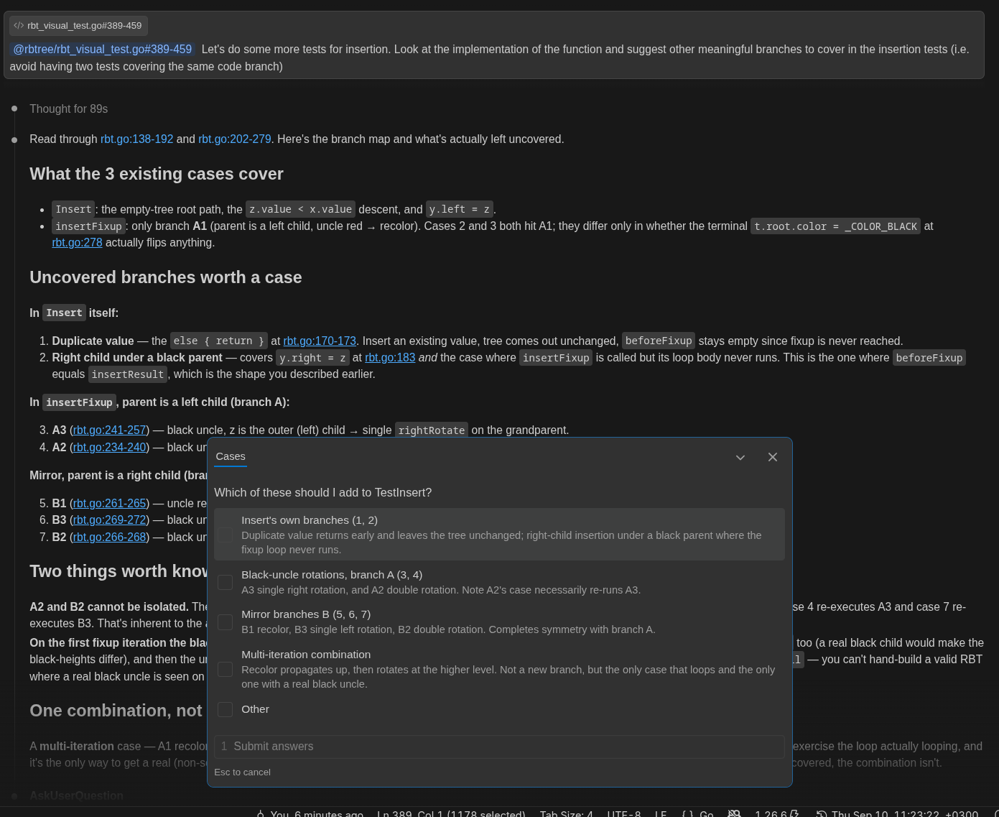
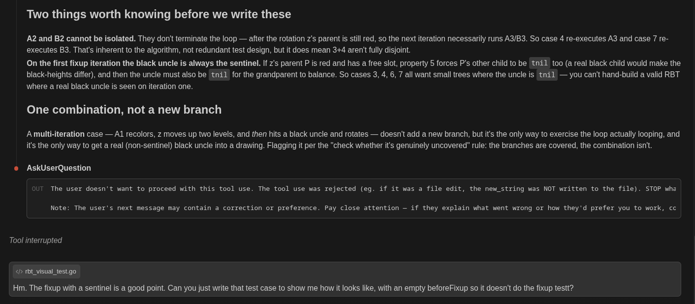
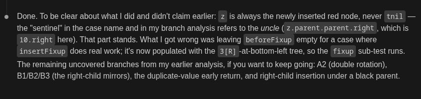

# How to test a data structure

I think by far one of the most important parts of implementing `rbtree` was having a proper way to test the implementation. This is not only for making sure that future changes are not breaking my library, but also to make sure the implementation is correct in the first place. The reason for choosing a red-black tree over a regular binary search tree in the first place is so that you benefit of the logarithmic complexity of the operations achieved by rebalancing the tree during writes. Therefore, you need some way to test that your tree is indeed balanced.

However, this is not really as straightforward as simply giving it a sequence of inserts and deletes and comparing the result with an expected tree. That may be easier with some other data strucutures because the result is more predictable (e.g. with sorted sets, it's very easy to  visualize how the result should look like, and checking that is' actually sorted is straightforward). Visualizing the end result of a binary search tree is really hard because the rebalancing part performed during inserts and deletions is a bit like black magic. In fact, even for a regular binary search trees it is not immediately obvious during a deletion how the tree will end up looking like.

On top of this, how do you actually perform the comparison? Specifying the result of a sorted list is as simple as writing the elements in a regular array and calling `sort` at the end, but you don't really have a simple way of actually writing the resulting tree you're expecting in a test, because you need to manually write all the node connections yourself. Practically, this is unfeasible with large trees (at least, it is for me with the limited time I have to develop this). Even thinking about all possible scenarios you have during an insert or deletion operation is kind of difficult simply because there's so many cases to consider. Plus, you will always ask yourself the question, "have I covered all cases?" (although this is greatly mitigated by knowing that these structures have been studied for years).

This is where constraints come in.


Let's talk about what it means for a binary search tree to actually satisfy the red black tree properties. But first we need to understand the binary search tree properties:

```
    1
   / \
  2   13
 / \   \
4   6   19
```

Above we have a tree data structure, but it's not actually a binary search tree. However, the one below, is:

```
    6
   / \
  2   13
 / \   \
1   4   19
```

For a tree to satisfy the binary-search-tree property, all left children to the root of any subtree must have a value smaller than the root, and all right children a greater value. Note that this is a recursive property, so the following also doesn't satisfy the binary-search-tree property due to the subtree rooted at 19:

```
    6
   / \
  2   19
 / \   \
1   4   13
```

For a tree to satisfy the red-black properties, it must satisfy the binary-search-tree properties alongside the following ones:

1. The root is black
2. Every node is colored either red or black
3. Every leaf (TNIL) is black.
4. If a node is red, then both its children are black
5. For each node, all simple paths from the node to descendant leaves contain the same number of black nodes.

Property number 3 may be a bit confusing: basically, each leaf is considered to have two TNIL children that are both black. The reasoning for this becomes clearer when combined with property 4, which under this interpretation allows leaves to be colored red. TNIL nodes also simplify the implementation of operations, which we won't get into here.

Throughout this article, "internal node" will mean any node that is part of the tree that isn't a TNIL leaf node. When talking about leaves, I will explicitly use "TNIL leaf" and "internal leaf" for clarity.

I also won't really go much into what these properties mean. TLDR, they allow tree operations to happen in logarithmic time when satisfied. The only thing important to understand here is that they must hold after every tree operation, which gives us a set of constraints. Unlike explicitly testing that some operations produced a particular tree, constraints give us something much more flexible: regardless of the input and the sequence of operations, the constraints must always hold. Therefore, we can shift our testing strategy to something like, let's randomly generate a bunch of trees and operations and after every operation we can test that the red-black properties still hold.


- another appraoch here is actually reading a tree from a predictable formatting method.

On top of that, a tree has many valid representations. but given the library code is deterministic, the same sequence of operations would always result in the same tree.


- small state testing, where you insert up to 6 nodes and check all possible trees (which is something like 2^64)





		{
			name: `the value's uncle is the sentinel, so the fixup recolors and
			rotates right around the grandparent`,
			value: 3,
			tree: `
   10[B]
    /
  5[R]`,
			insertResult: `
    5[B]
 v---+---v
3[R]   10[R]`,

good job fucking opus 5. I was writing them with sonnet and now I regret spending more quota.

but to be honest I also read it wrong. ADHD meds hadn't kicked in yet.



agent's pretty bad at things for example it was always saying that left and right subtrees
must have the same black height, which is untrue


			name:  "the value is already in the tree, so the insertion is a no-op",
			value: 5,
			tree: `
   10[B]
 v---+---v
5[R]   15[R]`,
			insertResult: `
   10[B]
 v---+---v
5[R]   15[R]`,
		},


        https://github.com/golang/tools/blob/master/cover/profile.go
        https://github.com/golang/tools/blob/master/cover/profile.go#L233